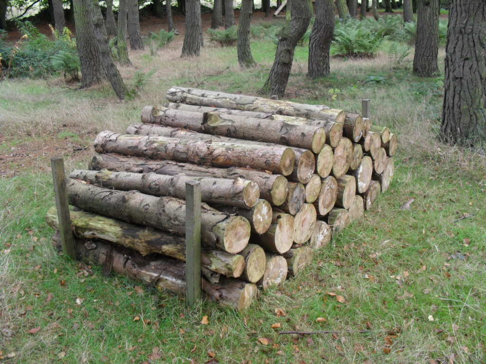

# Performance
## VIP Workshop 2015

---

# Introductions

Note:
Go around the room and ask everyone to introduce themselves. Start with yourself.

Name; Location; Company and Role; What you're hoping to learn today? Longest downtime you've seen on your current site?

---

## Outline

* Why performance issues happen
* Diagnosing
* Avoiding/Solving
* Common Mistakes
* Cache Stampedes
* `geo.php` Exercise

---

> "WordPress is slow today. Can you please fix it?"

Note:
These types of reports are common. Not a lot to go on. Why do we care?

---

> "WordPress is slow"

becomes

> "WordPress is down"

Note:
Nobody wants a slow or a downed site.

Impacts user happiness, bounce, and return rates and eventually lost revenue.

---

## Why does this happen?
### Everything is finite

---

## Example: Airport Queues


Note:
How many people flew here? How many people had to line-up during that trip?

Airport queues. There are limited counters to serve you and 1-n lineups. At some point, all counters will be full and create a backup in the line.

---

## Add some extreme circumstances

Long/holiday weekend, more flights at-capacity.

Note:
Double or triple the usual number of people.

Long lines. Open more counters but there's still a limit.

---

## Add some inefficiencies

Inefficiencies during the lineup will slow things down.

Note:
For example, checkpoints at various parts of the line where you have to show your ID.

Security, where you have to take things out of bag.

---


---

## Servers have limits, too

Every server in your stack (web, db, cache, etc.) has a capacity.

Every extra millisecond spent in a calculation or a functions or a query is a lost millsecond for someone or something else.

Note:
Servers are kinda like airport queues.

---

## High Traffic as an extreme circumstance

High levels of traffic or high volumes of content/data will stretch our limits.

Note:
Add a whole bunch of traffic (common now with viral nature of the web).

Or even outage/slowdown somewhere in the stack (e.g. external API).

---

## Bad code is our inefficiency

Bad code/config makes things go kaboom!

Note:
Can overwhelm servers, which can lead to slowdowns or shutdowns.

---

## Find issues before they happen

Our goals:

* Predict what circumstances could be bad.
* Find and fix suboptimal code.

Note:
Sometimes hard to predict the impact of complex code until you see it in a high-traffic scenario despite assessing against numerous patterns/observations.

---

> "WordPress is slow"

Note:
Back to our example.

---

## Hard to pinpoint

It could be any one of hundreds of different things wrong here.

---

## Data Gathering

Gather more data about the reported problem so we can narrow it down.

---

## Datas

URL where the issue happened? front-end? backend? both? specific actions? any errors seen or reported? screenshot or screencast available? happening to everyone or just one person or a small group? happening everywhere (desktop, mobile with 3G, mobile with wifi)? reproducible consistently? sporadic? etc.

---

## Assess and Hypothesize

Start to rule out things like:

* user issues (network connectivity?)
* upstream problems (data centre down?)
* not enough capacity (need more servers?)
* bad neighbours (slow site on the same shard/pool?)
* server misconfiguration

---

## Bad Code

We're often left with the sad realization that our application code as the main problem.

---

## Ways To Fix Bad Code

* **Remove:** Don't do it at all.
* **Reduce:** Do it better.
* **Reuse:** Do it once and use it again.

---

## Remove

```shell
$ rm -rf /
```

Note:
Pretty important to do. Doing less things means less overall work.

For everything on the site, ask: is this really needed?

Usually has the biggest impact over most things you can do.

---

## Remove
### Responsive bloat

```text
User-agent: Chrome, OS X
253 requests | 4.5 MB transferred

User-agent: Chrome, Android 4.4.4
178 requests | 3.3 MB transferred
```

Note:
How many people have responsive sites? Do you selectively show/hide headers/sidebars/footers for mobile browsers?

---

## Reduce
### Optimize

Optimize the (query|request|thing)

Note:
Use EXPLAIN on a query and optimize it.
For remote requests, find better APIs or batch requests.
Use alternate mechanisms for querying, like ES.

---

## Reduce
### Bad Code logic

```
$objects = get_cached_array_of_objects();
$found_object = false;
foreach ( $objects as $object ) {
	if ( 'the-right-one' == $object->id ) {
		$found_object = $object;
	}
}
```

Note:
Missing a berak; should bail when you find what you’re looking for.

What if the array of objects had 1000s (e.g. redirects)

---

## Reduce
### Alternate Querying Engines

Elasticsearch is fast. Really, really fast.

Note:
Or Lucene. Or any other system that better indexes that data we need to query.

Not really a magic bullet. See next.

---

## Reduce

Not always possible.

Note:
WP_Query sucks and some queries will just be slow. Sometimes have to resort to direct SQL.

Remote APIs aren't under our control.

Significant amount of work or workarounds.

With ES, not all queries will be fast (or faster than MySQL); e.g. querying post by ID. Also, requires a remote request.

---

## Reuse
### Cache cache cache

Cache cache cache

Note:
The thing we fallback to most often because we can only remove/reduce so much.

---

## Reuse
### What to cache?

* Variables
* Objects
* Fragments (pieces of rendered HTML)
* Full pages (the whole rendered page)
* Assets (CDN)

---

## Reuse
### Where to cache them?

Note:
A look at different tools/APIs available at various levels in our stack

Where we cache/store them depends on importance/cost of generation/frequency.

---

## Non-Persistent Caches

* Variables (global or local)
* `static $var`
* Object Cache API (without a persistent store)
* Object Cache API (with non-persistent groups)

Note:
These values are lost on every pageload but can come in handy

Non-persistent groups are usually for things that we reuse many times in a page but can't easily invalidate.

---

## Persistent Caches
### Transient APIs

* Object Cache API (`wp_cache_*()`)
* Transient API (`*_transient()`)

Note:
Persist across pageload but not always guaranteed. And can expire

---

## Persistent Caches
### Permanent APIs

* Options API (`*_option()`)
* Meta API (`get_*_meta()`)
* Custom Post Types

Note:
Won't expire, but come with a higher cost (writes are slow).

---

## Persistent Caches
### Full-page

WP Super Cache, W3TC, WP Rocket, Batcache, nginx, Varnish

Note:
This is the one that really helps you scale after you've optimized everything else.

WordPress is slow to load. Batcache can do 500ms => 4s. nginx and others can do it even faster.

Makes personalization hard. Disable for logged-in users?

---

## Aside: Cache Loop

Most caching interactions follow a simple loop-based pattern:

```
value = get from cache
if ( value was not in cache ) {
    generate value
    save value in cache
}
do stuff with value
```

Note:
Other patterns exist, but this is the simplest, most common one.

---

## Persistent Caches
### Async Generation

Fetch data outside the web request and store it (e.g. via cron job).

Why? Stampedes.

Note:
We'll get to stampedes later.

Can still cause stampedes with this if we trigger the async generation from a web request.

---

## Always Be Measuring

Measure before, measure after, measure in-between.

Note:
We need to make sure we're measuring everything we're targetting.

See if it's worth fixing in the first place. Don't spend 90% of your time changing something that accounts for 0.1% of the page.

See if we made it better or worse after the change. And over time.

Tools: Query Monitor, Debug Bar, New Relic, Web Page Test, etc.

---

# 99 Problems

* Common problems across VIP sites
* Many of the techniques noted may feel completely intuitive.
* Many of the workarounds needed are a lot of work.

Note:
The workarounds will help keep the site up when things need to scale.

---

## Problem
### Direct Database Queries

Direct database queries usually bypass caching. Even with caching, stampedes can be bad.

Note:
If absolutely necessary, evaluate the potential performance of these queries before using.

WP_Query and other APIs have multiple layers of caching. Plus, forwards compatibility (not related to performance).

---

```
global $wpdb;
echo (int) $wpdb->get_var( "SELECT COUNT( * ) FROM ..." );
```

---

## Problem
### Filesystem reads/writes

Disk I/O is slow.

Multiple servers? Each server does the read/write (`process time * n servers`).

Note:
Not a good idea to do on a distributed platform distributed across many servers in multiple data centers.

---

## Problem
### Front-end DB writes

Database writes are slow and expensive.

Note:
Writes are significantly more expensive than writes. Only sent to small subsets of servers.

---

```
$views = (int) get_post_meta( get_the_ID(), 'views', true );
update_post_meta( get_the_ID(), 'views', $views++ );
```

Note:
Using meta (post_meta, comment_meta, etc.) to track counts of things (e.g. votes, pageviews, etc.) is problematic on its own. Caching is hard. No guarantee of atomicity of data.

---

## Problem
### Uncached Remote Calls

Remote calls block pageloads. Remote resources are unreliable.

---

```php
$facebook_graph_url = 'https://graph.facebook.com/WordPress';
$response = wp_remote_get( $facebook_graph_url );
$data = json_decode( $response );
```

---

## Uncached Remote Calls
### Consequences

Hit rate limits => No data displayed on your site.

Request is slow or fails => Your site is slow or goes down.

Note:
Without error handling, site can look broken.

Without timeouts or caching can easily impact site.

---

## Uncached Remote Calls
### Must haves

* Hit the fastest and best endpoint
* Reasonable timeout limit
* Error handling (non-200 responses)
* Fallback data
* Exponential backoff for prolonged failure
* Cache returned data

---

> wpcom_vip_file_get_contents()

Note:
This function handles almost all of the things above

---

## Problem
### Skipping full-page caches

**High-volume requests** that are not cacheable via full-page cache.

On VIP, that could mean using using `$_GET/POST/REQUEST` params (e.g. `?abc=def`) or funnelling through admin-ajax.

---

## Exercise: AJAX Ads

http://vip-workshop.dev/performance/ads/

iframe-based ads for front-end speed benefits.

Note:
Very common use case.

Helps with sites that have infinite scroll or responsive designs.

---

## AJAX Ads

```php
<?php
$ad_url = add_query_arg( array(
	'action' => 'my_ad',
	'size' => '728x90',
	'zone' => 'zone-1',
	'rand' => rand(),
), site_url( 'wp-admin/admin-ajax.php' ) );
?>
<iframe src="<?php echo esc_url( $ad_url ); ?>" width="728" height="90" /><iframe>
```

---

## AJAX Ads

What problems can we run into?

---

## AJAX Ads

* 3 ads per page = 3 uncached trips to the server
* 3 * 300ms = 900ms extra time per user per page
* 900ms * n users = ?

---

## AJAX Ads

**Goal:** Cut down the server-side cost of each individual ad or ad request.

There are a few ways to significantly improve this particular implementation.

---

## AJAX Ads
### Solution #1

Rewrite the code to use rewrite rules (i.e. pretty permalinks) so that we can pass them through Batcache.

```diff
+ Much faster
- A lot more code and complexity
- Still PHP-bound
```

---

## AJAX Ads
### Solution #1.5

Could also just make the full-page cache cache those requests :)

```diff
+ Likely easy
- Still PHP-bound
```

---

## AJAX Ads
### Solution #2

Have the iframe load a static file and have it load the necessary configs via querystring.

```diff
+ Extremely fast; low effort
- Limited flexibility
```

---

## AJAX Ads
### Solution #3

Find a better ad server :)

Note:
May need to re-negotiate requirements with Sales, Management, Clients, etc. and find an alternate approach to implementing ads :)

---

## AJAX Ads: Solution #n

Any others?

---

## Problem
### Slow Queries, Big Queries

* Queries with no `LIMIT` set.
* Queries with very high limits.
* Complex queries with poor EXPLAIN results (`filesort`!)

---

## Problem
### Reverse Meta Lookups

Storing data in meta makes sense. Doing queries against the data when the number of entries for any given key is in the many multiple thousands does not make sense.

---

## Reverse Meta Lookups
### Legacy URLs

* Common requirement to maintain legacy URL redirects when migration.
* Makes sense to store the legacy URL association in meta.
* But, the actual query doesn't...

---

## Reverse Meta Lookups
### Legacy URLs

Three days before go-live for a site, we noticed that a site would become sluggish for no reason at various points with no immediately visible cause. After lots of back and forth, eventually pinpointed it to a bot  testing for 404s.

---

## Reverse Meta Lookups
### Legacy URLs

**Problem:** The queries were taking 30 seconds or more because the meta query had to scan through 1.8 million rows worth of redirects...

```
get_posts( array(
	'meta_key' => 'legacy_redirect',
	'meta_value' => $url,
	'posts_per_page' => 1,
	...
) );
```

---

## Reverse Meta Lookups
### Legacy URLs

**Solution:** http://vip.wordpress.com/plugins/wpcom-legacy-redirector/

Using posts as an alternate store as that table provides indexes (post_name) for quick lookups.

(Query went from 30s to 0.4ms)

Note:
Sometimes have to be clever and flex WordPress in interesting ways.

---

## Related Posts

Implementing a WP_Query-driven Related Posts solution is rarely very good.

```php
$related_posts = get_posts( array(
	'cat' => $post_cats,
	'tag' => $post_tags,
	'post__not_in' => array(
		get_the_ID()
	)
) );

// SELECT * FROM wp_posts
//     WHERE term_taxonomy_id = 123
//     AND wp_posts.ID NOT IN (456)
```

---

## Related Posts
### Problem #1

Very low hit- and quality-rate (especially if looking up exact match of tags and categories). Depends entirely on how good the editorial tagging system is. Also, biases against newer posts.

---

## Related Posts
### Problem #2

**post__not_in:** Asking a database to exclude a single post is significantly more expensive than doing it in PHP, especially if that exclusion makes the query unique amongst its peers. Makes for a terrible cache hit rate.

---

## Problem
### Low Cache Hit Rates

Too much varied data; not enough requests/usage.

```php
$key = 'related_posts_' . $post_id . '_' . $location;
wp_cache_get( $key );
```

Note:
memcached follows LFU (least-frequently used). If cached but not requested often enough, first to go. If it's flushed a lot, query is done a lot.

---

## Cache Stampedes Will Break You

Cache stampede: when a load of requests in succession kick of the same expensive process because all of them hit an empty cache on or around the same time.

---

## A Fireplace, A Lumberjack, and A Pile o' Wood



Note:
Analogy: fireplace in a cabin is powered by wood kept in a woodpile.

When empty, we have to go chop some more wood from the forest.

---

## Too many lumberjacks chopping the same wood


Note:
You get to the cabin but notice an empty woodpile, so you go to the forest to chop more.

Friend 1 comes along and notices empty woodpile and also heads to the forest.

Friend 2 does the same thing.

3 people doing the manually intensive thing. Cache stampedes are the same.

---

# How Cache Stampedes Work?

http://vip-workshop.dev/performance/stampede/

---

## Exercise: Trending Tags

```sql
SELECT DISTINCT terms2.term_id, COUNT(terms2.slug) as numposts FROM
  wp_posts as p1
  LEFT JOIN wp_term_relationships as r1 ON p1.ID = r1.object_ID
  LEFT JOIN wp_term_taxonomy as t1 ON r1.term_taxonomy_id = t1.term_taxonomy_id
  LEFT JOIN wp_terms as terms1 ON t1.term_id = terms1.term_id, wp_posts as p2
  LEFT JOIN wp_term_relationships as r2 ON p2.ID = r2.object_ID
  LEFT JOIN wp_term_taxonomy as t2 ON r2.term_taxonomy_id = t2.term_taxonomy_id
  LEFT JOIN wp_terms as terms2 ON t2.term_id = terms2.term_id
  WHERE
    t1.taxonomy = 'category' AND p1.post_status = 'publish'
	AND t2.taxonomy = 'post_tag' AND p2.post_status = 'publish'
	AND p1.ID = p2.ID AND '2015-05-03' <= p1.post_date
    AND terms2.slug NOT LIKE '%abc%'
    AND terms2.slug NOT LIKE '%def%'
    AND terms2.name NOT LIKE '%ghi%'
  GROUP BY terms2.slug
  ORDER BY numposts DESC
  LIMIT 5
```

Note:
From an actual VIP site from a long time ago.

Ran on every pageload.

Returned 5 pairs of numbers.

---

## Trending Tags
### Cost

**Uncached:** Varying query times between 10ms (SQL cache) to 500ms to 10+ seconds.

**Cached:** low ms in no traffic; 30+ seconds in high traffic (because of stampedes)

### Solutions?

Thoughts?

---

## Stampede
### Solution #1: Remove

```shell
$ rm -rf
```

(Analogy: move to Florida)

---

## Stampede
### Solution #1: Remove

**New Cost:** Really, actually free! :)

---

## Cache Stampede
### Solution #2: Optimize

Fix the slowness. Make the query or process faster by rewriting it or changing the requirements or other less expensive ways to get the same data.

(Analogy: buy a chainsaw; or a bulldozer; or dynamite)

---

## Cache Stampede
### Solution #2: Optimize

**New Cost:** Depends.

Note:
On how good the optimization was.

---

## Cache Stampede
### Solution #3: Locking

Prevent the pileup.

(Analogy: Have someone posted at the woodpile telling newcomers that wood is being chopped)

---

## Cache Loop

```php
$tags = wp_cache_get( 'key' );
if ( false === $tags ) {
	$tags = my_get_trending_tags();
	wp_cache_add( 'key', $tags );
}
```

---

## Cache Loop (with Locking)

```
$tags = wp_cache_get( 'key' );
if ( false === $tags && false === wp_cache_get( 'lock' ) ) {
	wp_cache_add( 'lock', 1, '', MINUTE_IN_SECONDS );
	$tags = my_get_trending_tags();
	wp_cache_add( 'key', $tags );
	wp_cache_delete( 'lock' );
}
```

Note:
Better at handling stampedes. But still possible; depends on speed of writing to cache and propagating.

Especially with multiple datacentres because cache values either won't sync or not fast enough.

---

## Stampedeless Cache
### Helper Class

From `includes/class.stampedeless-cache.php`:

> The Stampedeless Cache prevents runs on the data store whenever a cache value expires by storing the value along with a separate lock.
> When a value is soon going to expire the lock will be grabbed so that only one process will actually regenerate the data rather than a stampede.

---

```php
$slcache = new Stampedeless_Cache( 'key', 'group' );
$slcache->prevent_initial_stampede( /* default data here */ );
$tags = $slcache->get();
if ( false === $tags ) {
	$tags = my_get_trending_tags();
	$slcache->set( $tags, 5 * MINUTE_IN_SECONDS );
}
```

Note:
Abstracts away from of the cruft to make it easier, quicker, less code to implement lock-based caches.

---

## Cache Stampede
### Solution #3: Locking

**New Cost:** Depends on how good the lock is, but more likely on the low end.

---

## Cache Stampede
### Solution #4: Generate Async

Separate the cache generation process from the fetching process entirely.

(Analogy: hiring a logging company to keep your woodpile stocked)

---

## On Publish

```php
add_action( 'publish_post', function() {
	// TODO: Should be more selective here, not every `publish_post`
	$tags = my_get_trending_tags();
	update_option( 'my_trending_tags', $tags );
} );
```

---

## Cron

```php
wp_schedule_event( time(), 'hourly', 'my_calc_trending_tags' );

add_action( 'my_calc_trending_tags', function() {
	$tags = my_get_trending_tags();
	update_option( 'my_trending_tags', $tags );
}

function my_get_trending_tags() {
	return get_option( 'my_trending_tags' );
}
```

---

## Cache Stampede
### Solution #4: Generate Async

**New Cost:** Essentially free!

(**Caveat:** Careful not to create too many async requests.)

Note:
Example: if your process takes 2 minutes but you're running the job every minute, that's going to be a problem. REST API tests is a good example.

---

## Cache Stampede
### Summary

Bad for you, but very common. Fix by:

1. Removing;
1. Optimizing;
1. Locking; or
1. Generating on the side.


---

## geo.php

http://vip-workshop.dev/performance/

(~/www/performance/wp-content/themes/performance)

Note:
Many slow things, all based on examples of things sites have done.

---

## geo.php
### Domo arigato, Mr Roboto

Note:
Use curl to test TTFB for requests.

Good way to test because we can treat each request as a new visitor.

---

```shell
$ time | curl http://vip-workshop.dev/performance/
shell  0.00s user 0.00s system 0% cpu 8:16:02.13 total
children  0.00s user 0.00s system 0% cpu 8:16:02.13 total
```

FAST!

---

## Let's add a few more requests...

---

```shell
$ echo "GET http://vip-workshop.dev/performance/" | vegeta attack -duration=5s | tee results.bin | vegeta report
# [waiting]
# [waiting]
# [waiting]
Requests	[total, rate]			250, 50.20
Duration	[total, attack, wait]		34.982997675s, 4.979999815s, 30.00299786s
Latencies	[mean, 50, 95, 99, max]		30.002385146s, 30.00173959s, 30.005279608s, 30.007094073s, 30.008413663s
Bytes In	[total, mean]			0, 0.00
Bytes Out	[total, mean]			0, 0.00
Success		[ratio]				0.00%
Status Codes	[code:count]			0:250
Error Set:
Get http://vip-workshop.dev/performance/: net/http: timeout awaiting response headers
```

<small>I wouldn't recommend running this...</small>

Note:
vegeta is a local load testing tool. Really cool.

Over 5s, send 250 requests (50 reqs/s). All of them fail.

Fun fact: I initially thought this was due to a bug in the code, but later narrowed it down to Vagrant limits.

---

```text
504 Gateway Time-out
```

Note:
Will cripple vagrant. If that happens, `vagrant halt` and `vagrant up`.

---

## What went wrong?

\#blamevagrant

Note:
Vagrant sucks as a load testing environment... :)

Can't really handle much load.

Not the perfect test either: everything on the same server (even external APIs) and low-powered.

We can beef it up but still not ideal.

---

## Let's try fewer requests

```shell
$ echo "GET http://vip-workshop.dev/performance/" | vegeta attack -duration=5s --rate=2 | tee results.bin | vegeta report
Requests	[total, rate]			10, 2.22
Duration	[total, attack, wait]		5.06756477s, 4.499999832s, 567.564938ms
Latencies	[mean, 50, 95, 99, max]		791.406876ms, 800.303557ms, 909.860985ms, 909.860985ms, 1.038968319s
Bytes In	[total, mean]			131190, 13119.00
Bytes Out	[total, mean]			0, 0.00
Success		[ratio]				100.00%
Status Codes	[code:count]			200:10
Error Set:
```

Note:
Over 5s, send 10 requests (2 reqs/s)

Much better.

---

## Make it rain

The weather API is having some load issues...

```shell
$ echo "GET http://vip-workshop.dev/performance/" | vegeta attack -duration=5s --rate=2 | tee results.bin | vegeta report
Requests	[total, rate]			10, 2.22
Duration	[total, attack, wait]		10.291225284s, 4.499999804s, 5.79122548s
Latencies	[mean, 50, 95, 99, max]		5.594773068s, 5.532721352s, 5.748084033s, 5.748084033s, 5.79122548s
Bytes In	[total, mean]			130930, 13093.00
Bytes Out	[total, mean]			0, 0.00
Success		[ratio]				100.00%
Status Codes	[code:count]			200:10
Error Set:
```

Note:
Uncomment the "kill the API" section in the weather API and then run vegeta.

---

## geo.php

Let's find and fix the issues.

Note:
Focus more on the performance issues and less on the code quality (unless code quality directly impacts performance).

---

## geo.php

[Problems and Solutions](/1-geo-php.md)

---

# Q&A
